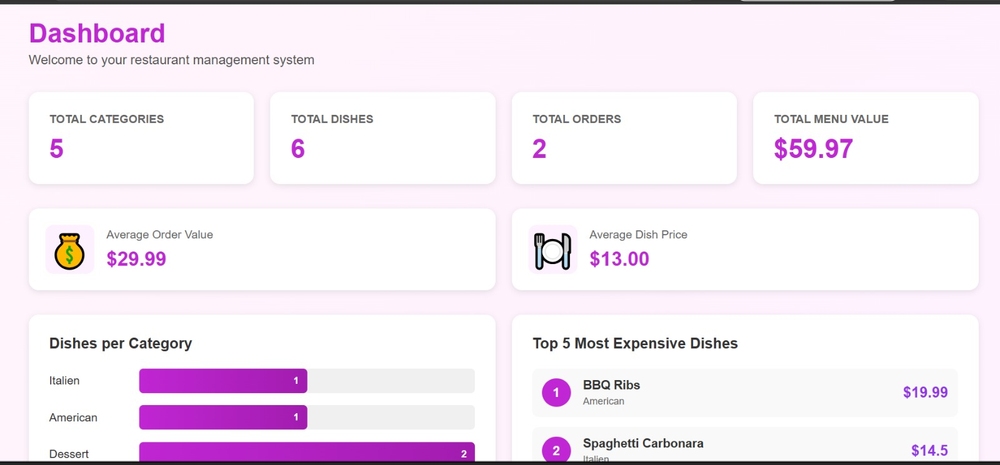
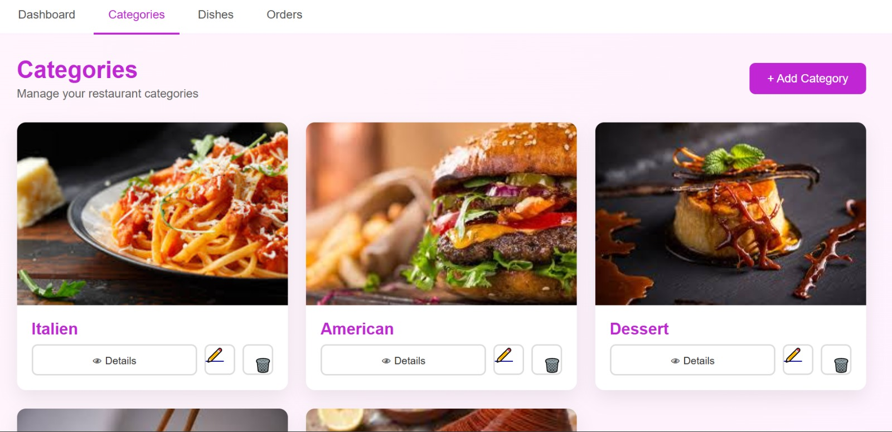
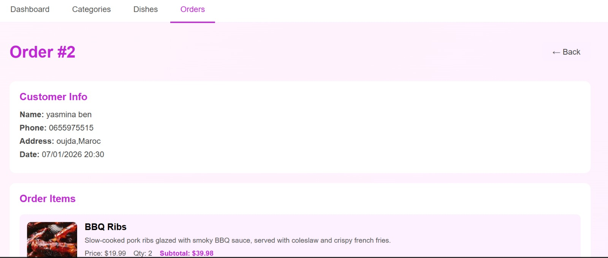
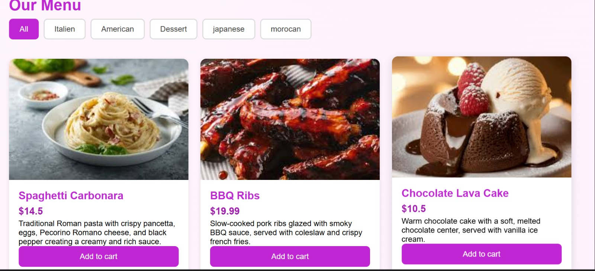
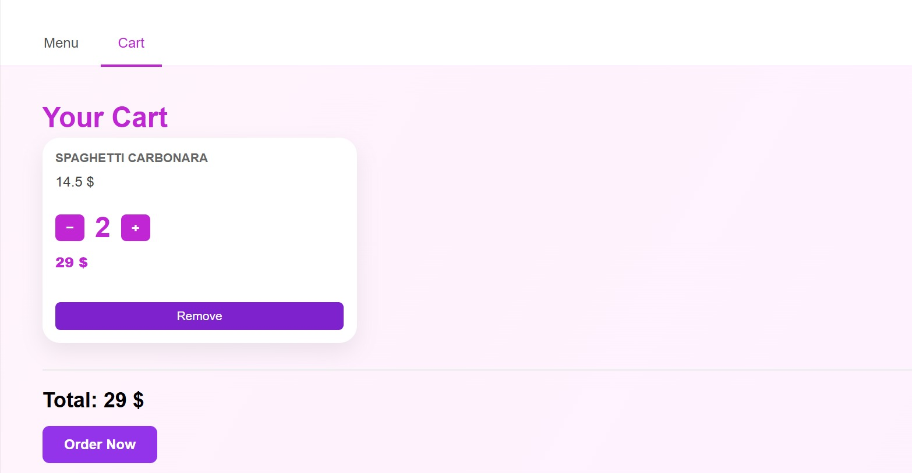

#  Restaurant Management System - Symfony

Application web développée avec Symfony permettant la gestion complète d’un restaurant avec deux rôles : administrateur et client.

---

##  Fonctionnalités

###  Administrateur
- Authentification sécurisée
- Gestion des catégories (CRUD)
- Gestion des plats (CRUD avec image, prix, description)
- Gestion des commandes
- Tableau de bord avec statistiques

###  Client
- Consultation des plats
- Filtrage des plats par catégorie
- Ajout au panier
- Passage de commande

---

##  Technologies utilisées

- Symfony
- PHP
- Doctrine ORM
- MySQL
- Twig
- HTML / CSS
- javascript

---
## Screenshots
### Admin




### Client


##  Installation

```bash
composer install
symfony server:start
